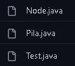

<table>
    <theader>
        <tr>
            <td></td>
            <th>
                UNIVERSIDAD NACIONAL DE SAN AGUSTIN 
                FACULTAD DE INGENIERÍA DE PRODUCCIÓN Y SERVICIOS 
                ESCUELA PROFESIONAL DE INGENIERÍA DE SISTEMAS
            </th>
            <td></td>
        </tr>
    </theader>
    <tbody>
        <tr><td colspan="3">Formato: Guía de Práctica de Laboratorio</td></tr>
        <tr><td>Aprobación:  2022/03/01</td><td>Código: GUIA-PRLD-001</td><td>Página: 1</td></tr>
    </tbody>
</table>

 <h3>INFORME DE LABORATORIO</h3>

<table>
 <theader>
  <tr><th colspan="6" bgcolor="red">INFORMACIÓN BÁSICA</th></tr>
 </theader>
 <tbody>
  <tr><td>ASIGNATUA:</td><td colspan="5">Estructura de Datos y Algoritmos</td></tr>
  <tr><td>TÍTULO DE LA PRACTICA:</td><td colspan="5">Pilas y Colas<td></tr>
  <tr><td>NÚMERO DE PRÁCTICA:</td><td>Practica de Laboratorio 03</td><td>AÑO LECTIVO:</td><td>2022 A</td><td>NRO. SEMESTRE:</td><td>III</td></tr>
  <tr><td>FECHA DE PRESENTACIÓN:</td><td>05/06/22</td><td>HORA DE PRESENTACIÓN:</td><td colspan="3">11:30 p.m.</td></tr>
  <tr><td>INTEGRANTES:</td><td colspan="3">-Diego Ivan Pacori Anccasi -Edson Joel López Quispe -Oliver Alessandro Mayta Nolasco -Edwin Francisco Aguilar Tancayo -Jordy Emanuel Ayma Cutipa</td><td>NOTA:</td><td>...</td></tr>
  <tr><td>DOCENTE:</td><td colspan="5">Richart Smith Escobedo Quispe - rescobedoq@unsa.edu.pe</td></tr>
 </tbody>
</table>
<table>
 <theader>
  <tr><th>SOLUCIÓN Y RESULTADOS</th></tr>
 </theader>
 <tbody>
  <tr><td><strong>I. SOLUCIÓN DE EJERCICIOS/PROBLEMAS:</strong> 
  <ul>
    <ol>
        <li>Pilas iguales</li>
            
De la funcion Pila se agregaron: 
               pilaVacia(): retorna un booleano(true = si no hay elementos, false = si hay elementos) 
               insertarNode(): Añade un elemento al final de la pila 
               eliminarNode(): Elimina el elemento que se encuentra al final 
               mostrarValores(): Muestra los elementos de la pila, del ultimo al inicial 
               Altura(): retorna la altura total del cilindro formando por los elementos de la pila

            
main(): se realizo la prueba de la practica 
               ingresarDatos(): agarra los elementos de un array y los pasa a una Pila 
               equalStack(): metodo el cual iguala las pilas y retorna ese valor comun entre las 3

        <li>Pilas</li>
        
-Se crearon tres clases:   -La clase Node (es la misma usada en el lab02 con ligeras modificaciones) almecena el valor en la variable <strong>data</strong> de tipo T y la dirección del Nodo siguiente en la variable <strong>nextNode</strong>. Preseta tres métodos <strong>enlazarSiguiente</strong>, <strong>obtenerSiguinte</strong>, <strong>obtenerValor</strong> y su contructor. -La clase Pila presenta la funcionalidad de esta variante de Lista, la clase está construida en base a lo indicado por la plataforma de Java <a href="https://docs.oracle.com/javase/8/docs/api/java/util/Stack.html">click aqui</a>. Los métodos implementados son: <strong>empty:</strong>Retorna un boleano si la Pila esta vacia o no <strong>peek:</strong>Retorna el elemento de la parte superior <strong>pop:</strong>Elimina el objeto de la parte superior <strong>push:</strong>Permite ingresar valores a la pila <strong>search:</strong>Retorna la posicion del dato solicitado , de no encontrarlo retorna -1, parte de la posicion 1. Presenta un constructor y su propio toString personalizado. -Para probar la implementación de la Pila se crea método Test en donde se realiza diferentes experimentos probando la funcionalidad de la Pila

        <li>Colas</li>
            
Las clases principales son Node, Cola, las otras clases son ejemplos de la implementación. La clase Node es la usada en el anterior lab, para la clase Cola, se implementaron los métodos <em>colaVacia</em> que regresa un buleano, otra clase es <em>insertar</em> que inserta un nuevo objeto en la cola, luego está el método <em>extraer</em> que retorna el valor de la cola y finalmente <em>mostrarcontenido</em> que imprime la cola

    </ol>
  </ul>

  </td></tr>
  <tr><td><strong>II. CUESTIONARIO:</strong> *¿Qué similitudes hay entre una Lista Enlazada y una Pila? Los métodos de la Pila se enfocan más en el último objeto y va desplazando a los demás objetos, por ello tiene un número inferior de métodos por la poca variedad de acciones que se puede realizar en comparación a las Lista ¿En que casos seria favorable/desfavorable utilizar Pila/Cola? -Es favorable usar colas por ejemplo cuando queremos que la lista siga el orden de llegada, y tambien cuando utilizamos frecuentemente los datos más antiguos, ya que accede a ellos inmediatamente. En el caso de las pilas la podemos usar por ejemplo en las torres de hanoi, en todos los casos donde necesitemos frecuentemente el dato que ingresó último.  
  </td></tr>

  <tr><td><strong>III. CONCLUSIONES:</strong> - Las clases genericas son muy efectivas, y fueron de gran utilidad al momento de crear las pilas y colas, estas Listas con caracteristicas similares, son estructuras de datos que dependiendo de la situacion resultan más eficientes que las simples listas de Array. 
  </td></tr>
 </tbody>
</table>

<table>
 <theader>
  <tr><td>RETROALIMENTACIÓN GENERAL 
  </td><tr>
 </theader>
 <tbody>
  <tr><td>Las pilas son parecidas a las listas enlazadas y el primer elemento en entrar es el ultimo es salir, un ejemplo puede ser: poner platos uno encima de otro, y si quiero obtener el primer plato, tendria que sacar los que estan encima de este. 
  Las colas tienen un sistema igual al de los bancos, cuando uno llega primero es atentido  primero, y si llegas ultimo tienes que esperar a que los demas salgan para que te toque tu turno.</td></tr>
 </tbody>
</table>

<table>
 <theader>
  <tr><td>REFERENCIAS Y BIBLIOGRAFÍA</td><tr>
 </theader>
 <tbody>
  <tr><td><strong><em>https://docs.oracle.com/javase/8/docs/api/java/util/Stack.html</em></strong></td></tr>
  <tr><td><strong><em>https://lineadecodigo.com/java/crear-una-pila-en-java/</em></strong></td></tr>
  <tr><td><strong><em>https://www.cartagena99.com/recursos/alumnos/apuntes/PilasYColas.pdf</em></strong></td></tr>
  <tr><td><strong><em>http://estructuradedatosjp.blogspot.com/2015/11/pilas-y-colas-en-java.html</em></strong></td></tr>
  <tr><td><strong><em>https://programacionparajava.blogspot.com/p/programas-sencillos-usando-estructura.html</em></strong></td></tr>
 </tbody>
</table>
